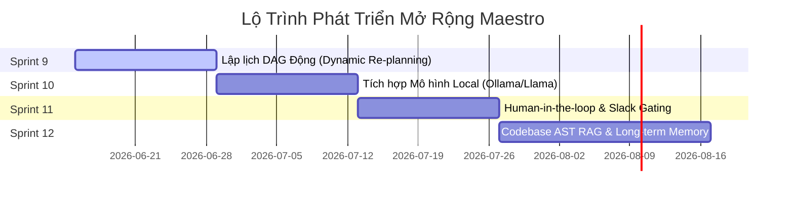

# 🚀 Kế Hoạch Mở Rộng Dự Án Maestro (Maestro Project Expansion Plan)

Tài liệu này vạch ra định hướng phát triển chiến lược tiếp theo cho Maestro nhằm nâng cấp hệ thống từ một bộ điều phối Multi-Agent cục bộ thành một nền tảng lập trình tự động toàn diện cho doanh nghiệp (Enterprise-ready Autonomous Software Swarm).

---

## 📅 Lộ Trình Các Sprint Mở Rộng (Future Sprints Roadmap)

---

## 🛠️ Chi Tiết Từng Sprint (Sprint Specifications)

### 1. Sprint 9: Lập Lịch DAG Động & Tự Động Tái Lập Hoạch (Dynamic DAG Re-planning)
* **Mục tiêu**: Cho phép đồ thị nhiệm vụ (DAG) tự động co giãn và thay đổi cấu trúc động trong lúc thực thi (runtime) dựa trên kết quả chấm điểm thực tế.
* **Chi tiết kỹ thuật**:
  * Hiện tại, đồ thị nhiệm vụ được dựng cố định lúc khởi chạy. Nếu tác vụ trung gian gặp lỗi nghiêm trọng, hệ thống sẽ dừng (cascade block).
  * **Cải tiến**: Thiết lập bộ phân tích lỗi dựa trên Grader. Nếu phát hiện lỗi cấu trúc (ví dụ: DB Schema thiếu cột), LLM Planner sẽ tự động chèn thêm một Node nhiệm vụ sửa lỗi khẩn cấp vào giữa đồ thị, cập nhật lại mối quan hệ phụ thuộc (dependencies) bất đồng bộ mà không cần dừng toàn bộ pipeline.
* **Đầu ra**: Lệnh `maestro run --dynamic` hỗ trợ tự tái cấu trúc đồ thị động.

---

### 2. Sprint 10: Tích Hợp Mô Hình Mã Nguồn Mở Cục Bộ (Local Specialists & LLM Swarms)
* **Mục tiêu**: Cho phép chạy hoàn toàn offline và miễn phí bằng cách tích hợp các mô hình open-source chạy trực tiếp trên máy chủ vật lý của nhà phát triển.
* **Chi tiết kỹ thuật**:
  * Xây dựng thêm Adapter cho **Ollama / Llama.cpp** và **vLLM**.
  * Định tuyến nhiệm vụ linh hoạt: Các tác vụ viết code boilerplate đơn giản hoặc linter được chuyển cho các mô hình nhỏ (ví dụ: `Qwen-2.5-Coder-7B`, `DeepSeek-Coder-6.7B` chạy cục bộ). Chỉ các tác vụ thiết kế kiến trúc hệ thống cốt lõi mới được định tuyến lên các mô hình thương mại lớn (`Claude 3.5 Sonnet` / `GPT-4o`).
* **Đầu ra**: Khả năng định tuyến đa mô hình kết hợp (Hybrid API + Local models) giúp giảm chi phí thêm **50% - 80%**.

---

### 3. Sprint 11: Cổng Duyệt Của Con Người & Cộng Tác (Human-in-the-Loop Gating)
* **Mục tiêu**: Cho phép con người can thiệp, kiểm duyệt và định hướng cho Agent trước khi thực hiện các hành động rủi ro cao.
* **Chi tiết kỹ thuật**:
  * **Cổng phê duyệt (Approve Gate)**: Chèn cổng phê duyệt tại các Node nhạy cảm như (deploy lên môi trường staging, xóa/migrate database, gọi thanh toán API).
  * **Kênh tương tác**: Maestro sẽ gửi thông báo chứa mã nguồn/ảnh trực quan lên **Slack / Discord** hoặc dừng màn hình terminal CLI kèm nút nhấn Phê duyệt (`[Approve] / [Reject]`). Nếu Reject, lập trình viên có thể gõ text góp ý trực tiếp để chuyển thẳng vào vòng lặp phản hồi (`feedback.md`) của Agent.
* **Đầu ra**: Tích hợp cổng CLI tương tác và Slack Webhook approval flow.

---

### 4. Sprint 12: Bộ Nhớ Dài Hạn & Tra Cứu Cấu Trúc Mã Nguồn (Codebase AST RAG)
* **Mục tiêu**: Cung cấp cho các Agent khả năng hiểu biết sâu sắc về toàn bộ cấu trúc dự án hiện tại, tránh việc viết mã nguồn mới xung đột với các hàm/kiến trúc cũ.
* **Chi tiết kỹ thuật**:
  * **Trích xuất cây cú pháp (AST indexing)**: Dùng `Tree-sitter` hoặc `Language Server Protocol (LSP)` để băm mã nguồn thành sơ đồ lớp, mối quan hệ hàm và các module phụ thuộc.
  * **Băm Vector (Codebase Vector Store)**: Chuyển dữ liệu AST vào Vector Database cục bộ (ChromaDB / Qdrant).
  * Khi Specialist nhận tác vụ, Maestro tự động tìm kiếm các đoạn code tương tự hoặc các API liên quan trong dự án để làm context bổ trợ, giúp Agent viết code chuẩn hóa theo style-guide sẵn có của dự án.
* **Đầu ra**: Phân hệ `maestro/memory/` hỗ trợ RAG mã nguồn thông minh.

---

## 📈 Đánh Giá Hiệu Quả Kinh Tế (ROI & Metrics)

| Chỉ số (Metrics) | Hiện tại (Sprint 8) | Mục tiêu sau mở rộng (Sprint 12) | Rationale (Lý do cốt lõi) |
| :--- | :---: | :---: | :--- |
| **Tự động sửa lỗi** | Tối đa 2 lần retry mù | Không giới hạn nhờ DAG Động | Tự động tạo Task chữa lỗi động khi Grader trượt. |
| **Chi phí API LLM** | ~$0.05 / task | **<$0.01 / task** | Nhờ định tuyến sang mô hình local (Ollama/Qwen). |
| **Mức độ an toàn** | Sandbox Host Fallback | **Docker Gated Security** | Không rò rỉ API keys nhờ bộ lọc môi trường. |
| **Tính nhất quán code** | Tự viết độc lập | **AST-Conformant** | Tránh viết đè hàm cũ nhờ bộ nhớ Codebase RAG. |

---

## 💡 Khuyến Nghị Triển Khai (Deployment Suggestions)

1. **Giai đoạn 1 (Ngắn hạn - Sprint 9 & 10)**: Tập trung tối ưu hóa chi phí bằng cách cấu hình mô hình nội bộ (Ollama) và nâng cấp Scheduler lên cơ chế DAG động để giải quyết các lỗi logic khó trong vòng lặp.
2. **Giai đoạn 2 (Dài hạn - Sprint 11 & 12)**: Tập trung vào tính an toàn doanh nghiệp và quản trị mã nguồn lớn thông qua cổng Slack duyệt của con người và bộ nhớ RAG ngữ cảnh.
