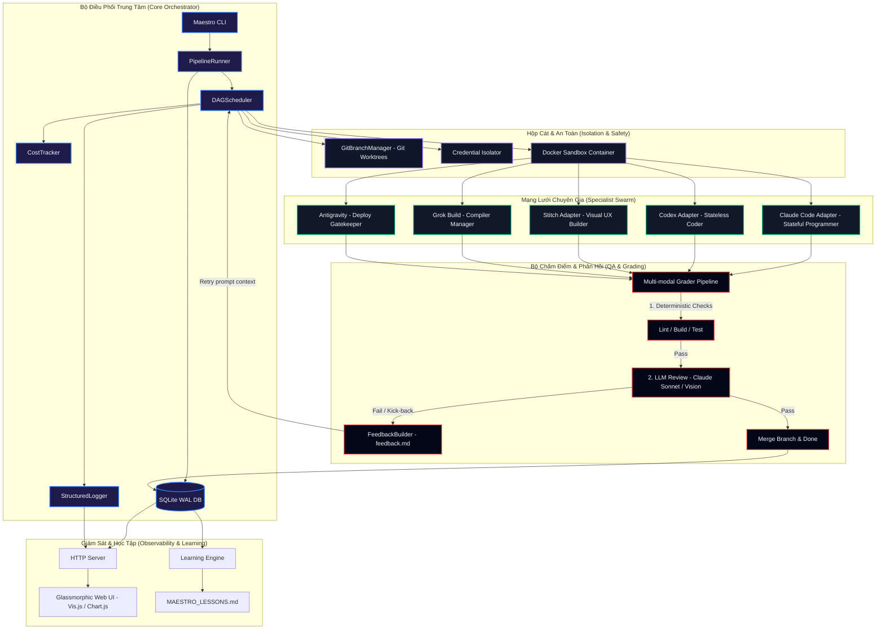

# Maestro — Multi-Agent Software Engineering Orchestrator
## 📖 Tài Liệu Hướng Dẫn & Thiết Kế Chi Tiết Hệ Thống (Bilingual Architecture & Developer Guide)

[](https://github.com/khoitran3172/maestro/actions)
[](https://www.python.org/)
[](LICENSE)

*Read this in other languages: [Tiếng Việt](#tiếng-việt-vietnamese) | [English](#english)*

---

# Tiếng Việt (Vietnamese)

## 1. Giới Thiệu & Nền Tảng Dự Án (Project Origin & Background)

Trong kỷ nguyên của các mô hình ngôn ngữ lớn (Frontier LLMs), các công cụ lập trình AI đơn lẻ thường gặp phải các hạn chế nghiêm trọng khi đối mặt với các dự án phần mềm lớn:
* **Chi phí khổng lồ & Phình prompt (Prompt Bloat)**: Gửi toàn bộ mã nguồn của một dự án lớn vào một prompt duy nhất cho mỗi thay đổi nhỏ gây lãng phí token.
* **Lỗi hồi quy (Regression Errors)**: Sửa tính năng này nhưng vô tình làm hỏng tính năng khác do thiếu quy trình kiểm thử (testing) và chấm điểm (grading) nghiêm ngặt.
* **Xung đột khi thực thi song song**: Các tác vụ lập trình độc lập bị nghẽn hoặc ghi đè tập tin của nhau khi chạy trên cùng một thư mục làm việc.

**Maestro** ra đời để giải quyết các vấn đề này bằng cách áp dụng triết lý **Multi-Agent chuyên biệt hóa** (Multi-Agent Swarm). Hệ thống tổ chức công việc dưới dạng một đồ thị phân nhiệm có hướng (DAG), phân phối các công việc lập trình cho các chuyên gia AI chuyên biệt, chạy song song trong các hộp cát (sandbox) cách ly bằng Git và Docker, và tự động kiểm tra chất lượng đầu ra thông qua bộ chấm điểm đa phương thức.

---

## 2. Tầm Nhìn & Mục Tiêu Dự Án (Vision & Objectives)

### 2.1. Tầm Nhìn (Vision)
Xây dựng một nền tảng điều phối lập trình tự động (Autonomous Software Engineer Swarm) có khả năng tự lập kế hoạch, tự phân công công việc cho các agent chuyên trách, tự sửa lỗi thông qua vòng lặp phản hồi grader và tự động báo cáo các bài học kinh nghiệm thu được sau mỗi lượt chạy.

### 2.2. Mục Tiêu Cốt Lõi (Core Objectives)
1. **Định tuyến thông minh (Smart Specialist Routing)**: Phân phối đúng việc cho đúng chuyên gia (ví dụ: Claude Code cho công việc sửa lỗi hệ thống phức tạp, Codex cho viết mã tính năng nhanh, Stitch cho giao diện và kiểm thử visual).
2. **Tiết kiệm chi phí API (Cost efficiency)**: Chạy các Grader kiểm thử cục bộ miễn phí trước (build, test, lint). Chỉ gọi các Grader LLM (Claude Sonnet/Vision) đắt đỏ sau khi mã nguồn đã biên dịch thành công.
3. **Cách ly & Bảo mật (Sandbox Isolation)**: Không cho phép các mã độc hại hoặc câu lệnh của Agent làm hỏng hệ thống máy chủ hoặc rò rỉ mã khóa API (API keys) nhờ Docker Container và Credential Filtering.
4. **Quan sát & Học hỏi tự động (Observability & Self-Learning)**: Cung cấp giao diện Web trực quan theo dõi đồ thị nhiệm vụ (DAG) trực tiếp, biểu đồ chi tiêu tích lũy (cost burn-down) và tự động viết báo cáo bài học kinh nghiệm `MAESTRO_LESSONS.md`.

---

## 3. Đối Tượng Thụ Hưởng (Stakeholders)

* **Lập Trình Viên (Software Developers)**: Tự động hóa việc viết code tính năng, chạy unit tests và sửa lỗi cú pháp tự động thông qua vòng lặp phản hồi của Maestro.
* **Kiến Trúc Sư Phần Mềm (Software Architects)**: Thiết kế các luồng phát triển phần mềm phức tạp, phân mảnh dự án lớn thành các node nhiệm vụ chạy song song bất đồng bộ nhằm tối ưu thời gian bàn giao sản phẩm.
* **Đội Ngũ Vận Hành & DevOps**: Triển khai mã nguồn lên môi trường staging/production một cách an toàn thông qua cổng kiểm soát an toàn Antigravity.

---

## 4. Kiến Trúc Hệ Thống (System Architecture)

Maestro được xây dựng dựa trên sự liên kết chặt chẽ của 6 phân hệ cốt lõi:



### 4.1. Bộ Lập Lịch Đồ Thị Bất Đồng Bộ (Async DAG Scheduler)
Maestro phân tích cấu trúc nhiệm vụ của dự án từ tệp tin cấu hình và biên dịch chúng thành một Directed Acyclic Graph (DAG). Các node nhiệm vụ độc lập (ví dụ: Tạo giao diện trang chủ và cấu hình các bảng dữ liệu database) được phân bổ để chạy **song song đồng thời**. Trạng thái được kiểm soát chặt chẽ thông qua các cờ hiệu `asyncio.Event` để mở khóa các tác vụ tiếp theo ngay khi các tác vụ phụ thuộc (dependencies) hoàn tất thành công.

### 4.2. Cách Ly Mã Nguồn (Git Worktree Isolation)
Để đảm bảo các Agent không ghi đè, tạo ra xung đột ghi file cục bộ khi chạy song song:
1. Maestro tạo một nhánh Git tạm thời: `maestro/{specialist}-{task_id}`.
2. Gắn nhánh này vào một thư mục làm việc riêng biệt ngoài thư mục chính bằng lệnh `git worktree add`.
3. Mọi thao tác ghi tệp, chạy thử nghiệm của Specialist được thực hiện cách ly trên worktree đó.
4. Khi tác vụ vượt qua kỳ thi của Grader, worktree được tự động commit, merge về nhánh gốc và xóa dọn dẹp sạch sẽ. Nếu có xung đột khi merge, hệ thống tự động rollback an toàn.

### 4.3. Đóng Hộp Sandbox & Lọc Thông Tin Đăng Nhập
* **Docker Sandboxing**: Toàn bộ câu lệnh của Specialist được thực thi đóng hộp bên trong container ảo hóa, giới hạn dung lượng RAM tiêu thụ và cách ly hoàn toàn tệp tin hệ thống của máy chủ vật lý.
* **Credential Filtering**: Maestro quét và lọc bỏ toàn bộ các biến môi trường nhạy cảm của máy chủ trước khi truyền vào container. Chỉ các biến môi trường khớp cấu hình Specialist được phép đi qua (ví dụ: Chỉ cấp `OPENAI_API_KEY` cho Codex, xóa sạch mã khóa AWS hay mật khẩu cơ sở dữ liệu hệ thống).

### 4.4. Cổng Chấm Điểm & Phản Hồi Ngữ Cảnh (Feedback Loop)
Hệ thống chấm điểm chia làm 2 vòng nghiêm ngặt:
1. **Vòng 1 (Deterministic Checks)**: Biên dịch code, chạy pytest/npm test, kiểm tra linter. Nếu có lỗi biên dịch, tác vụ bị trượt ngay lập tức (short-circuit).
2. **Vòng 2 (LLM Evaluation)**: Nếu mã nguồn biên dịch tốt, Maestro gửi code đến Claude Sonnet để đánh giá logic bảo mật, chất lượng kiến trúc; gửi screenshot giao diện đến Claude Vision để kiểm định tính thẩm mỹ trực quan.
3. **Phản hồi (Feedback)**: Khi trượt, `FeedbackBuilder` tự động viết một báo cáo `feedback.md` chứa mã lỗi compiler, linter warnings, các bài test thất bại và so sánh diff mã nguồn để Specialist sửa lỗi có định hướng cụ thể.

---

## 5. Mô Hình Dữ Liệu (Data Model - SQLite WAL Schema)

Hệ thống ghi nhận và duy trì toàn bộ lịch sử chạy của dự án bằng SQLite chế độ WAL (Write-Ahead Logging) hỗ trợ đọc ghi song song bất đồng bộ, bao gồm các bảng dữ liệu sau:

```
+---------------------------------------------------------------------------------+
|                                     runs                                        |
+---------------------------------------------------------------------------------+
| run_id (PK) | project_name | status | task_graph_json | total_spent_usd | ...   |
+---------------------------------------------------------------------------------+
                                       | (1)
                                       |
                                       | (N)
+---------------------------------------------------------------------------------+
|                                     tasks                                       |
+---------------------------------------------------------------------------------+
| task_id (PK) | run_id (FK) | specialist | phase | status | input_prompt | ...  |
+---------------------------------------------------------------------------------+
         | (1)                                      | (1)
         |                                          |
         | (N)                                      | (N)
+------------------------+                +---------------------------------------+
|       artifacts        |                |           feedback_history            |
+------------------------+                +---------------------------------------+
| artifact_id (PK)       |                | feedback_id (PK)                      |
| task_id (FK)           |                | task_id (FK)                          |
| file_path              |                | iteration | grade_score | failures    |
| content_hash           |                | issues_text | prev_artifact_hash      |
+------------------------+                +---------------------------------------+
```

* **runs**: Quản lý thông tin chung của một lượt chạy (ngân sách trần, tiến độ, trạng thái tổng quan).
* **tasks**: Quản lý chi tiết từng node nhiệm vụ trong DAG, ghi nhận duration (thời gian chạy), cost (chi phí phát sinh), grading score (điểm chấm chất lượng) và git branch đang quản lý.
* **artifacts**: Lưu vết và băm nội dung SHA-256 của toàn bộ tệp tin đầu ra do Agent tạo ra để theo dõi tính toàn vẹn dữ liệu.
* **feedback_history**: Lưu lịch sử sửa lỗi của Agent qua từng iteration (lượt thử lại), lưu vết lỗi rubric và lời khuyên của bộ chấm điểm.
* **cost_log**: Nhật ký chi tiêu tài chính chi tiết của từng Specialist theo thời gian thực (real-time).

---

## 6. Cổng Kết Nối & Tương Tác Phân Hệ (System Connections)

* **Specialist Invocations**: Hệ thống kết nối với các CLI của Specialist (ví dụ: Claude Code CLI) thông qua các lớp adapter kế thừa từ `SpecialistAdapter`. Mọi luồng vào/ra đều được chuẩn hóa thành cấu trúc dữ liệu `TaskInput` và `TaskOutput`.
* **Grader APIs**: Multi-modal Grader kết nối trực tiếp với API của Anthropic (sử dụng thư viện chính thức của Anthropic thông qua HTTP Client của Maestro) để gửi mã nguồn hoặc hình ảnh phân tích.
* **Dashboard Server**: Dashboard của Maestro giao tiếp thông qua giao thức HTTP REST. Máy chủ cục bộ truy vấn SQLite trực tiếp, lọc tệp tin `.maestro/log.jsonl` và trả về kết quả dạng JSON cho trang web HTML5/JS giao diện Glassmorphism.

---

## 7. Hướng Dẫn Cài Đặt (Setup Guide)

### Yêu cầu tiên quyết
* **Python**: Phiên bản `3.11` trở lên.
* **Git**: Phiên bản `2.40` trở lên (bắt buộc cho tính năng Git Worktree).
* **Docker**: Cần thiết nếu bạn muốn đóng hộp Specialist an toàn (nếu không chạy, Maestro tự động fallback chạy an toàn trên host).

### Bước 1: Clone dự án và cài đặt Package ở chế độ Development
```powershell
git clone https://github.com/khoitran3172/maestro.git
cd maestro
pip install -e .
```

### Bước 2: Thiết lập biến môi trường bảo mật (`.env`)
Tạo một tệp tin `.env` tại thư mục gốc của dự án và điền thông tin sau:
```env
ANTHROPIC_API_KEY=your-anthropic-api-key-here
OPENAI_API_KEY=your-openai-api-key-here
MAX_USD=5.00
MAESTRO_SANDBOX=0  # Thiết lập thành 1 nếu bạn muốn Specialist thực thi trong Docker
MAESTRO_GIT_ISOLATION=1  # Thiết lập thành 1 để chạy cách ly Git Worktrees song song
```

### Bước 3: Chạy thử nghiệm bộ unit tests để kiểm tra môi trường
```powershell
python -m pytest tests/ -v
```

---

## 8. Hướng Dẫn Sử Dụng (Usage Guide)

Maestro hỗ trợ bộ các câu lệnh CLI thân thiện, dễ vận hành:

### 8.1. Chạy một luồng dự án mới (`maestro run`)
Thiết lập tệp tin cấu hình pipeline dự án dạng JSON (ví dụ: `pipeline.json`):
```json
{
  "project_name": "My Landing Page",
  "max_budget_usd": 1.5,
  "phases": [
    {
      "phase": 1,
      "name": "Design Page Layout",
      "specialist": "claude_code",
      "command_template": ["echo", "layout-created"]
    },
    {
      "phase": 2,
      "name": "Create Tailwind Styles",
      "specialist": "antigravity",
      "command_template": ["echo", "tailwind-injected"]
    }
  ]
}
```
Khởi chạy dự án:
```powershell
maestro run pipeline.json --workspace .
```

### 8.2. Tiếp tục luồng chạy bị gián đoạn (`maestro resume`)
Nếu dự án bị dừng do vượt quá giới hạn ngân sách tối đa trong ngày (`MAX_USD`), bạn chỉ cần tăng `MAX_USD` trong file `.env` và chạy lệnh sau để Maestro tự động tải lại trạng thái và chạy tiếp từ checkpoint bị gián đoạn gần nhất:
```powershell
maestro resume
```

### 8.3. Xem tiến độ trực tiếp trên Terminal (`maestro status`)
In bảng chi tiết các tác vụ, chi phí tiêu thụ, thời gian thực thi của từng phase nhiệm vụ:
```powershell
maestro status
```

### 8.4. Mở Cổng Giám Sát Web Dashboard trực quan (`maestro dashboard`)
Khởi động máy chủ giám sát cục bộ:
```powershell
maestro dashboard --port 8000
```
Mở trình duyệt web và truy cập: `http://localhost:8000`. Bạn sẽ thấy giao diện Glassmorphism hiển thị trực tiếp đồ thị nhiệm vụ vật lý dạng Vis-network, đồ thị chi tiêu lũy kế của Chart.js, log console màu sắc thời gian thực và trình xem trước (preview) các artifact đầu ra.

### 8.5. Chạy các bài Benchmark chất lượng thử nghiệm (`maestro eval`)
Kiểm định tính năng của Maestro thông qua việc giả lập chạy thử 3 dự án mẫu (`Todo App`, `Blog Engine`, `Landing Page`):
```powershell
maestro eval
```

---

# English

## 1. Project Origin & Background

In the era of frontier Large Language Models (LLMs), single monolithic AI coders often face bottleneck constraints when scaling up to enterprise-level codebases:
* **Cost Inefficiency**: Sending the entire repository code context over expensive LLMs for minor edits causes massive token consumption.
* **Regression Faults**: Fixing one module occasionally breaks another due to a lack of automated sandboxed grading and tests.
* **Parallel Write Collisions**: Independent coding tasks block each other or overwrite working files when running on the same source root.

**Maestro** resolves these orchestration challenges by leveraging a **specialized multi-agent swarm architecture**. Instead of expecting one general-purpose LLM to perform planning, UI mockup, coding, testing, and deployment:
* **Claude Code** operates as a stateful terminal developer.
* **Codex** acts as a stateless, fast feature builder.
* **Stitch** handles UI layout visual feedback generation.
* **Grok Build** manages compilation and local testing.
* **Antigravity** governs cloud deployment gates.

---

## 2. Vision & Core Objectives

### 2.1. Vision
To create a fully autonomous, cost-conscious, and secure Multi-Agent developer swarm that schedules tasks in parallel, grades deliverables automatically, and writes its own runtime optimization guidelines to improve developer throughput.

### 2.2. Core Objectives
1. **Specialist Routing**: Direct task requirements only to the agent best suited for the job.
2. **Cost-Aware Gating**: Execute free local compilers/tests first, routing code to expensive LLM reviews only when compilation succeeds.
3. **Sandbox Enforcement**: Prevent arbitrary code executions from leaking host credentials or wiping host drives using Docker virtualization and credential filters.
4. **Bilingual Observability**: Offer developers dynamic visual DAG tracking, cost analytics, and lessons learned summaries.

---

## 3. Stakeholders

* **Software Developers**: Save time by delegating feature building, testing, and bug fixing to Maestro's autonomous loop.
* **Software Architects**: Split massive software backlogs into modular parallel DAG nodes to accelerate delivery timelines.
* **DevOps Engineers**: Guarantee safe build deployments via gated specialist verification scripts.

---

## 4. System Architecture

The core subsystems of Maestro interact as shown in the architectural diagram in the Vietnamese section:
1. **Async DAG Scheduler**: Parses pipeline steps and runs independent tasks concurrently using `asyncio.Event` synchronization.
2. **Git Worktree Isolation**: Spawns isolated Git branches and mounts them as physical worktrees to avoid write conflicts during concurrent runs.
3. **Sandbox Wrapper**: Virtualizes specialist tasks inside Docker containers, applying memory restrictions and gating network access.
4. **Grader Pipeline**: Rejects broken compiler runs early, utilizing Claude Sonnet (for code quality review) and Claude Vision (for visual layout checks) only when basic linter/builds pass.
5. **Web Dashboard Portal**: Serves database and log telemetry via a local HTTP server rendering glassmorphic Vis-network and Chart.js UI.

---

## 5. Data Model (SQLite WAL Schema)
Maestro registers project runs, tasks, cost logs, artifacts, and grading kick-backs in an async-compatible SQLite DB file configured with WAL (Write-Ahead Logging) mode. Check the diagram in the Vietnamese section for the table relations.

---

## 6. Setup & Usage

### Installation
```bash
git clone https://github.com/khoitran3172/maestro.git
cd maestro
pip install -e .
```

### Configuration (`.env`)
Create a `.env` file in the root folder:
```env
ANTHROPIC_API_KEY=your-anthropic-key-here
OPENAI_API_KEY=your-openai-api-key-here
MAX_USD=5.00
MAESTRO_SANDBOX=0  # Set to 1 to enable Docker Sandboxing
MAESTRO_GIT_ISOLATION=1  # Set to 1 to enable Git Worktree isolation
```

### Commands

* **Execute a Pipeline**:
  ```bash
  maestro run pipeline.json
  ```
* **Resume Paused Run**:
  ```bash
  maestro resume
  ```
* **View Run Progress**:
  ```bash
  maestro status
  ```
* **Open Observability Dashboard**:
  ```bash
  maestro dashboard --port 8000
  ```
* **Execute Benchmark Harness**:
  ```bash
  maestro eval
  ```
* **Run Unit Tests**:
  ```bash
  python -m pytest tests/ -v
  ```
