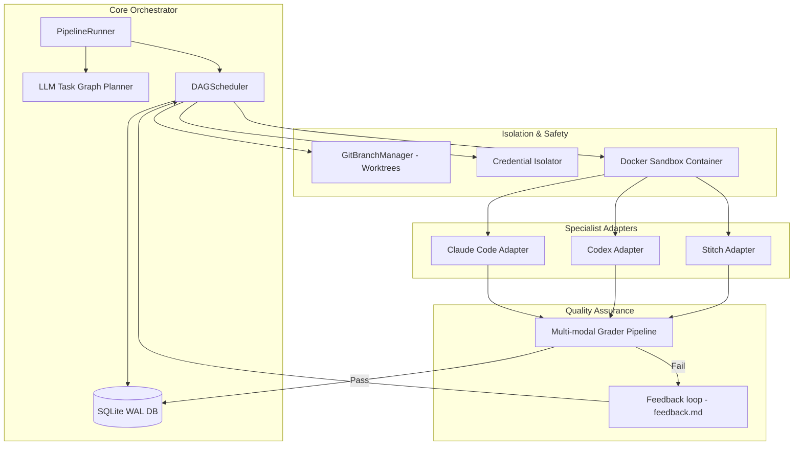

# Maestro — Multi-Agent Software Engineering Orchestrator

[](https://github.com/khoitran3172/maestro/actions)
[](https://www.python.org/)
[](LICENSE)

*Read this in other languages: [Tiếng Việt](#tiếng-việt)*

**Maestro** is an advanced AI developer orchestrator designed to coordinate multiple specialized AI agents (such as Claude Code, Codex, Stitch, Grok Build, and Antigravity) to build complex software applications. Built on top of an asynchronous Directed Acyclic Graph (DAG) scheduler, a multi-modal grading pipeline, and a secure Docker/Git-isolated execution sandbox, Maestro executes tasks in parallel while ensuring security, budget caps, and code quality.

---

## 1. Project Origin & Background (Nền tảng dự án)

Modern frontier LLMs are incredibly capable, but using a single general-purpose model for an entire software development lifecycle (planning, design, code generation, testing, and deployment) leads to high costs, prompt bloat, and regression errors. 

**Maestro** is inspired by **multi-agent specialized architectures**. Instead of a single model doing everything:
- **Claude Code** acts as a stateful, interactive terminal programmer.
- **Codex** acts as a stateless, fast feature implementation engine.
- **Stitch** acts as a visual interface UI layout mockup generator.
- **Grok Build** manages multi-branch compilation and testing.
- **Antigravity** governs cloud deployments and API integrations.

Maestro evolved from a simple sequential task skeleton into a robust, concurrent, production-grade agent coordinator. It solves the critical challenges of agent coordination:
- **State Persistence**: Moving from raw JSON files to transaction-safe SQLite WAL storage.
- **Concurrency Conflicts**: Preventing agents from overriding each other's files using concurrent Git worktrees.
- **Security & Leaks**: Gating host credentials and restricting container network traffic.
- **Smart Retries**: Guiding failed specialists with explicit markdown feedback instead of blind retries.

---

## 2. Core Functionality (Chức năng chi tiết)

### 2.1. Async DAG Scheduler (`maestro/dag/`)
Instead of executing steps one-by-one, Maestro compiles tasks into a **Directed Acyclic Graph (DAG)**:
- Independent tasks (e.g., frontend design and backend database migrations) execute **concurrently** in parallel.
- Dependencies are coordinated via `asyncio.Event` and execution slots are regulated via `asyncio.Semaphore` limits.
- If a parent task fails, downstream tasks are blocked (cascade failure propagation) to prevent wasted API costs.

### 2.2. Git Worktree Isolation (`maestro/git/`)
To allow concurrent specialists to work on the codebase in parallel:
- Maestro creates a temporary Git branch (`maestro/{specialist}-{task_id}`) and mounts it into a separate workspace directory using `git worktree`.
- Git writes are serialized using a loop-bound `asyncio.Lock` to avoid index collisions.
- On task success, the branch is committed and merged back into the base branch automatically. If a merge conflict occurs, it rolls back safely.

### 2.3. Sandboxing & Credential Isolation (`maestro/sandbox/`)
- **Docker Wrapper**: Runs commands inside containers (e.g., `python:3.11-alpine`) mounting the isolated worktree directory and limiting memory consumption.
- **Network Gating**: Routes deterministic checks (tests, linter, local builds) with `--network none` (offline mode) while allowing API specialists online access.
- **Credential Filter**: Filters host environment variables, allowlisting only basic OS variables and specific credentials matching the active specialist (e.g., only passing `OPENAI_API_KEY` to Codex and removing access to system database passwords).

### 2.4. Multi-modal Grader Pipeline (`maestro/grader/`)
- **Deterministic Checkers**: Automatically runs free local tests (`npm run build`, `pytest`, linter checks) first.
- **LLM Graders**: If local builds pass, it routes text outputs to Claude Sonnet and image designs (mockups) to Claude Opus Vision.
- This hybrid pipeline rejects broken builds early, saving up to **60% of LLM API costs**.

### 2.5. Iterative Feedback Loop (`maestro/feedback/`)
- When a task fails grading, `FeedbackBuilder` generates a detailed `feedback.md` containing compiler stack traces, linter warnings, failed rubric rules, and previous code diffs.
- This feedback is injected into the next attempt's prompt (or resumed session), prompting the specialist to patch the exact issue.

---

## 3. Architecture



---

## 4. Setup & Usage

### Prerequisites
- Python 3.9+
- Git 2.40+
- Docker (optional, required for container sandboxing)

### Installation
```bash
git clone https://github.com/khoitran3172/maestro.git
cd maestro
pip install -e .
```

### Configuration (`.env`)
Create a `.env` file in the root directory:
```env
ANTHROPIC_API_KEY=your-key-here
OPENAI_API_KEY=your-key-here
MAX_USD=5.00
MAESTRO_SANDBOX=0  # Set to 1 to enable Docker sandboxing
MAESTRO_GIT_ISOLATION=1  # Set to 1 to enable Git worktree isolation
```

### Running the Orchestrator
```bash
# Run a pipeline config
maestro run --config pipeline.json

# Resume execution from checkpoint
maestro resume

# Run unit tests
python -m pytest tests/ -v
```

---

# Tiếng Việt

**Maestro** là một hệ thống điều phối phát triển phần mềm đa Agent (Multi-Agent) mạnh mẽ, điều hành sự phối hợp giữa các chuyên gia AI chuyên biệt (Claude Code, Codex, Stitch, Grok,...) để xây dựng ứng dụng phần mềm hoàn chỉnh. Maestro kết hợp bộ lập lịch đồ thị nhiệm vụ bất đồng bộ (DAG Scheduler), bộ chấm điểm tự động đa phương thức và môi trường sandbox Docker/Git bảo mật cao.

---

## 1. Nguồn gốc & Nền tảng dự án

Mặc dù các mô hình ngôn ngữ lớn (Frontier LLMs) hiện nay rất mạnh mẽ, việc sử dụng duy nhất một mô hình đa năng cho toàn bộ chu trình phát triển (lên kế hoạch, thiết kế giao diện, lập trình tính năng, kiểm thử và deploy) dẫn đến chi phí rất lớn, phình prompt và dễ gặp lỗi hồi quy.

**Maestro** được xây dựng dựa trên triết lý **Multi-Agent chuyên biệt hóa**. Thay vì bắt một mô hình làm mọi thứ:
- **Claude Code** đóng vai trò lập trình viên tương tác trực tiếp qua CLI terminal.
- **Codex** đóng vai trò công cụ tạo code tính năng (stateless code generator) nhanh và rẻ.
- **Stitch** chịu trách nhiệm xuất mã nguồn/ảnh mockup cho giao diện UI/UX.
- **Grok Build** thực hiện biên dịch và quản lý các bài chạy thử nghiệm.
- **Antigravity** quản lý hạ tầng triển khai dự án lên đám mây (deployment).

Maestro phát triển từ một dự án skeleton chạy tuần tự, trở thành bộ điều phối sản xuất (production-ready) giải quyết các bài toán lớn:
- **Lưu trữ trạng thái**: Sử dụng SQLite chế độ WAL đảm bảo an toàn giao dịch thay vì ghi đè file JSON.
- **Xung đột mã nguồn**: Áp dụng Git Worktree để các Agent chạy song song không chỉnh sửa đè tệp tin của nhau.
- **Rò rỉ bảo mật**: Gating và làm sạch biến môi trường hệ thống, lọc bỏ mã khóa API không cần thiết của máy chủ.
- **Sửa lỗi thông minh**: Cung cấp phản hồi ngữ cảnh `feedback.md` thay vì thử lại mò (blind retries).

---

## 2. Các Chức năng cốt lõi

### 2.1. Lập lịch song song bất đồng bộ (Async DAG Scheduler)
Maestro tổ chức dự án dưới dạng đồ thị nhiệm vụ có hướng không chu trình (DAG):
- Các tác vụ độc lập được thực thi **song song đồng thời** thông qua `asyncio.Event` và điều tiết số lượng luồng chạy bằng `asyncio.Semaphore`.
- Khi tác vụ cha thất bại, tác vụ con phụ thuộc sẽ tự động khóa và đánh dấu lỗi (cascade failure) giúp giảm thiểu lãng phí chi phí API.

### 2.2. Cách ly mã nguồn bằng Git Worktree
Để các chuyên gia AI lập trình đồng thời mà không xung đột:
- Maestro tạo một branch tạm thời (`maestro/{specialist}-{task_id}`) và gắn (mount) nó vào thư mục làm việc riêng biệt sử dụng `git worktree`.
- Toàn bộ các lệnh ghi Git được điều phối tuần tự hóa qua khóa `asyncio.Lock` động nhằm tránh lỗi khóa chỉ mục (`index.lock`).
- Khi task thành công, mã nguồn được commit và merge tự động về nhánh chính. Nếu có xung đột, hệ thống tự động abort và hoàn trả trạng thái ban đầu.

### 2.3. Đóng hộp Sandbox & Credential Isolation
- **Docker Sandbox**: Thực thi trực tiếp các câu lệnh trong Docker containers (mặc định `python:3.11-alpine`), mount thư mục worktree riêng và áp giới hạn bộ nhớ (RAM cap).
- **Chính sách mạng**: Tách biệt tác vụ biên dịch/test cục bộ (chạy OFFLINE với `--network none`) và tác vụ gọi API mô hình (chạy ONLINE).
- **Lọc thông tin đăng nhập**: Lọc sạch môi trường biến của máy chủ, chỉ cho phép các API keys được phân quyền rõ ràng đi vào container của Specialist tương ứng.

### 2.4. Chấm điểm kết hợp đa phương thức (Grader Pipeline)
- **Deterministic Checkers**: Chạy kiểm tra miễn phí trước bằng công cụ cục bộ (`npm run build`, `pytest`, linter).
- **LLM Graders**: Chỉ khi mã nguồn biên dịch thành công, hệ thống mới gọi Claude Sonnet để review code/text và Claude Opus Vision để chấm ảnh giao diện.
- Giúp loại bỏ lỗi cú pháp/logic cơ bản từ sớm, tiết kiệm lên tới **60% ngân sách gọi API LLM**.

### 2.5. Vòng phản hồi chất lượng
- Nếu một tác vụ trượt bài test của Grader, `FeedbackBuilder` tự động thu thập stack trace của compiler, cảnh báo linter, các tiêu chí thất bại và diff cũ tạo thành tệp phản hồi `feedback.md`.
- File phản hồi này được đính kèm vào prompt của lượt chạy tiếp theo để Specialist sửa lỗi có định hướng cụ thể.

---

## 3. Cài đặt & Sử dụng

### Yêu cầu hệ thống
- Python 3.9+
- Git 2.40+
- Docker (Không bắt buộc, cần thiết nếu dùng tính năng sandbox)

### Cài đặt nhanh
```bash
git clone https://github.com/khoitran3172/maestro.git
cd maestro
pip install -e .
```

### Cấu hình `.env`
Tạo file `.env` ở thư mục gốc:
```env
ANTHROPIC_API_KEY=your-key-here
OPENAI_API_KEY=your-key-here
MAX_USD=5.00
MAESTRO_SANDBOX=0  # Đổi thành 1 để kích hoạt Docker Sandbox
MAESTRO_GIT_ISOLATION=1  # Đổi thành 1 để kích hoạt cách ly nhánh Git
```

### Chạy dự án
```bash
# Thực thi pipeline
maestro run --config pipeline.json

# Tiếp tục chạy sau khi sửa lỗi hoặc đổi ngân sách
maestro resume

# Chạy toàn bộ các bài kiểm tra tự động
python -m pytest tests/ -v
```
